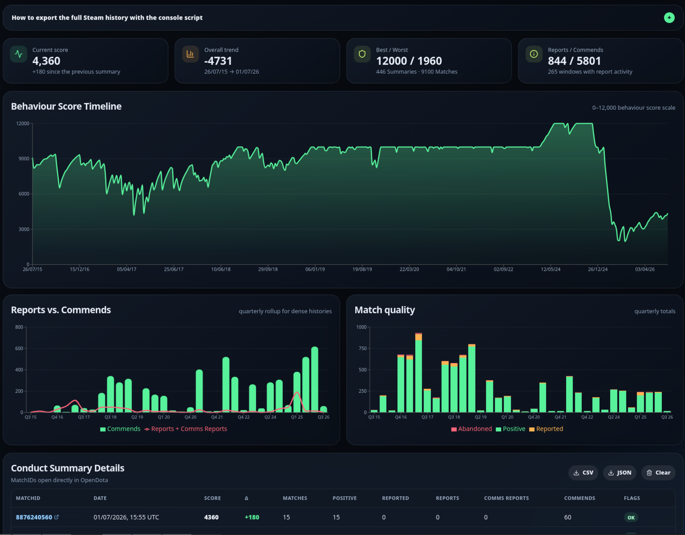

# Dota 2 Behaviour Score History

A static React/Vite app that parses your **Dota 2 Incoming Match Player Report / Conduct Summary** history from a saved Steam HTML file or exporter JSON locally in the browser and visualizes it with charts.



## Features

- drag & drop import for saved Steam HTML or exporter JSON
- fully client-side: no uploads, no backend, GitHub Pages friendly
- Behaviour score timeline
- 0–12,000 behaviour score scale, matching the current Dota 2 maximum
- Reports/Comms Reports vs. Commends per conduct window
- positive / reported / abandoned matches as stacked bars
- monthly chart rollups for dense multi-year histories
- KPI cards for current score, trend, best/worst, reports, and commends
- detail table with an OpenDota link for every `Conduct Summary MatchID`
- CSV and JSON export for parsed data
- LocalStorage: the last imported history stays available locally in your browser

## Export Steam data

Steam's **Load More History** rows are added by JavaScript. Depending on the browser, **Save Page As…** may save only the original first 20 rows. Use the console exporter below when that happens.

### Recommended: console exporter

1. Open the [Steam data page](https://steamcommunity.com/my/gcpd/570?category=Account&tab=MatchPlayerReportIncoming) while you are logged in.

2. Open browser DevTools on that Steam page.
   - Chrome/Chromium: `F12` → **Console**
   - Firefox: `F12` → **Console**
3. Click **Copy exporter script** in the app, or copy the complete contents of [`tools/steam-conduct-exporter.js`](tools/steam-conduct-exporter.js).
4. Paste it into the Steam page console and press Enter.
5. The script repeatedly calls Steam's own `Load More History` AJAX endpoint and downloads `dota2-conduct-history.json`.
6. Open this app and drop that `.json` file into the dropzone.

The exporter runs inside your logged-in Steam page and downloads a local JSON file. It does not send the data anywhere else. If Steam returns HTTP 429, wait a few minutes and run it again.

### Fallback: saved HTML

1. Click **Load More History** at the bottom until the button disappears or no more entries load.
2. Save the page in your browser with **Save Page As …** as HTML.
3. Open this app and drop the saved `.html`/`.htm` file into the dropzone.

> Note: GitHub Pages cannot fetch your private Steam link directly. The import is intentionally local. The file never leaves your browser.

## Local development

```bash
npm install
npm run dev
```

Quality checks:

```bash
npm test -- --run
npm run lint
npm run build
```

## GitHub Pages Deployment

The repo includes `.github/workflows/deploy.yml`.

1. In GitHub, open **Settings → Pages**.
2. Under **Build and deployment**, select **GitHub Actions** as the source.
3. Push to `main` when you are ready to publish.
4. The action builds the app and deploys `dist/` to GitHub Pages.

The Vite base in `vite.config.ts` is set to `/Dota2-Behaviour-Score-History/`, matching the repository name.
